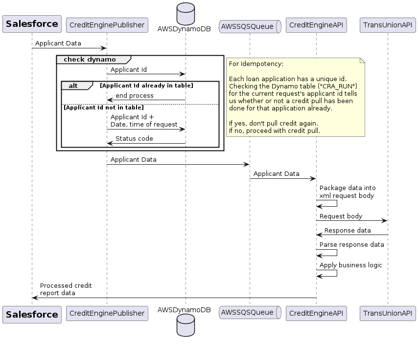
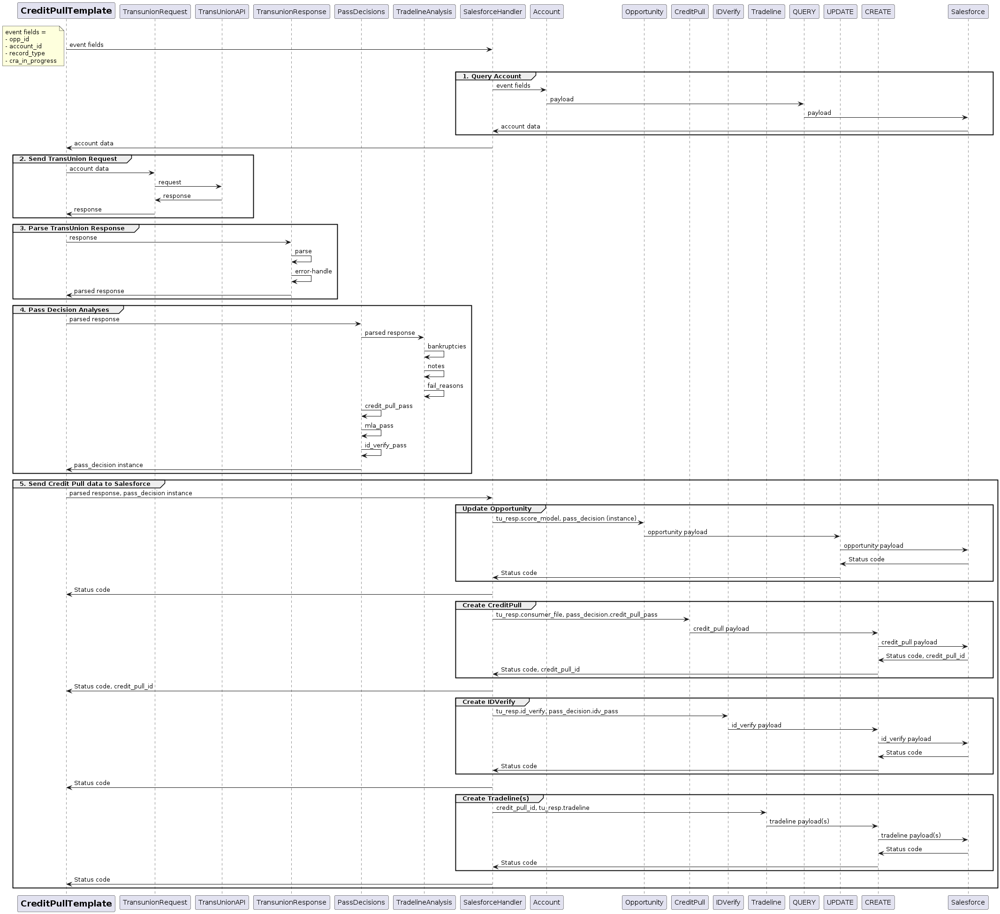

## Introduction
### Project Overview
The Credit Engine API was developed to automate the retrieval of credit data for a private lending fintech company specializing in higher education finance. Automating this process enhances the speed and accuracy of loan underwriting.
### Objectives
Automate credit pulls to streamline loan application processing
Reduce human error and increase data security during credit report handling
Facilitate the secure transfer of credit report data between third-party services
## Domain and Product Description
### Domain Overview
Our product operates within the financial technology (fintech) domain, with a specific focus on the educational finance sector. This sector is dedicated to integrating advanced technology solutions to streamline and enhance financial services for educational purposes, particularly through automation and data management. The Credit Engine API is an integral component of this, facilitating efficient, accurate financial assessments required for student loans.
### Product Overview
The Credit Engine API automates the extraction and integration of credit report data directly from a major credit bureau when a student applies for a loan. It uses robust authentication and encryption protocols to ensure data security, adhering to the highest standards of data protection. This automation boosts operational efficiency and enhances the decision-making process, providing a superior user experience for both loan officers and applicants.
### Target Audience
Primary users include loan underwriters within the company, leveraging the API to improve efficiency and accuracy in loan approvals. Secondary beneficiaries are college students applying for loans, who experience faster processing and enhanced security of their personal information.
## Problem Statement
### Challenges and Requirements
The API addresses significant challenges including the manual effort involved in credit pulls and the associated risks such as data entry errors and security vulnerabilities.
### Business and Technical Requirements
#### Business Requirements: 
Cost-effective operations, scalability to handle growth, compliance with data protection laws, timely market delivery, and intuitive user experience
#### Technical Requirements: 
Secure data transfer mechanisms, seamless integration with existing systems, robust data management and integrity safeguards, and specific technology stack choices.
## System Architecture & Design 
This architecture is designed to automate credit pulls efficiently and securely by integrating Salesforce, the custom Credit Engine API, and the TransUnion API. This streamlined process enhances data accuracy and speeds up the loan approval process within our fintech framework.
### Process Flow
1. Salesforce Activation: Triggered by changing an Opportunity’s (applicant’s underwriting record) stage to “Credit Pull”; Salesforce sends applicant data to the Credit Engine API (by way of API Gateway and AWS SQS)
2. Credit Engine API Initiates Request: Securely sends request data to TransUnion API using PEM certificate validation within a whitelisted AWS VPC subnet
3. TransUnion Interaction: TransUnion API returns requested credit report data
4. Credit Engine API Processing and Upload:
- API parses response data, applies business logic for evaluating applicant’s loan eligibility
- Uploads processed credit report data to originating Salesforce Opportunity
Security and Compliance
The process utilizes secure communication channels (PEM certificates), operating within a controlled network environment (AWS VPC), and ensuring data is handled in compliance with relevant financial regulations.

The system sequence diagram below depicts the flow of data between system components:

The API sequence diagram below depicts the data flow within the Credit Engine API as well as its interactions with third-party integrations:

## Technology Stack
### AWS Services
- AWS ECR for storing Docker container images of the API
- AWS Lambda for serverless, event-driven execution
- AWS DynamoDB for high-performance NoSQL data management 
- AWS API Gateway for secure publishing of API
- SQS for message queueing
- AWS IAM for resource access control
- VPC for network isolation
### Development Tools
- Git for version control
- Docker for containerization
- CircleCI for CI/CD
- Terraform Cloud for infrastructure management
### Third-Party Platforms
- TransUnion API for retrieving applicants’ credit report data
- Salesforce CRM for retrieving applicant data and storing credit pull results
## Security Measures
- Utilizes AWS VPC and subnets for network isolation, enhancing controlled access through whitelisting of IP ranges
- Employs PEM certificates for data encryption, ensuring secure data transmission
- Applies IAM roles to restrict resource access within AWS to authorized services and personnel only
